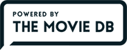

# `Showapp`

Este proyecto fue creado a partir de la semilla `angular-seed` Disponible [aquí][angular-seed].

En este proyecto se realizan llamados al API de The Movie DB. <br />



### Prerrequisitos

Necesitas git para clonar el repositorio `showapp`. Lo puedes conseguir [aquí][git].

La semilla de Angular necesita algunas herramientas de Node.js para iniciar y ejecutar pruebas. Debes tenerlo instalado junto con su administrados de dependencias (npm). 
Lo puedes descargar [aquí][node].

## Iniciar Aplicación

1. Para iniciar la aplicación debes clonar el repositorio utilizando git:
  
```
git clone https://github.com/pmazoc/showapp.git
cd showapp
```

2. Instalar las dependencias (para esto debes tener instalado npm):

```
npm install
```

3. Posteriormente, puedes iniciar la aplicación de forma local:

```
npm start
```

Luego de ejecutar este comando, obtendrás una URL en el Localhost para acceder a ella.

## Estructura de Directorios

```
app/                        --> todos los archivos fuente de la aplicación
  app.css                   --> hoja de estilos
  components/               --> cada uno de los módulos que componen la aplicación
    movies/                 --> componente para manipular el módulo de películas
      moviesController.js   --> controla la lógica del componente
      moviesService.js      --> conecta el controlador con la API expuesta
      moviesView.html       --> plantilla HTML del componente
  directives/               --> directivas creadas para la aplicación
  assets/                   --> contiene los objetos multimedia
  utils/                    --> utilitarios transversales a la aplicación  
  app.js                    --> módulo principal de la aplicación
  index.html                --> principal plantilla html
  index-async.html          --> el mismo index.html, pero carga los archivos JS de forma asíncrona
```
## Acceso

La aplicación está disponible en http://pmazoc.github.io/showapp

[angular-seed]: https://github.com/angular/angular-seed
[git]: https://git-scm.com/
[node]: https://nodejs.org/
[npm]: https://www.npmjs.org/
